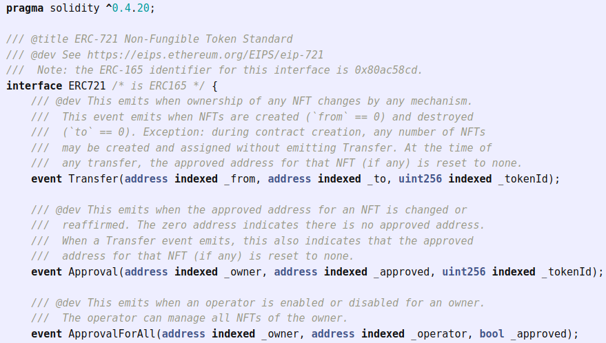
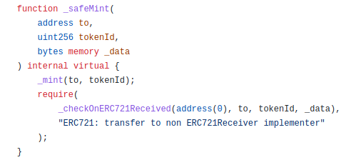
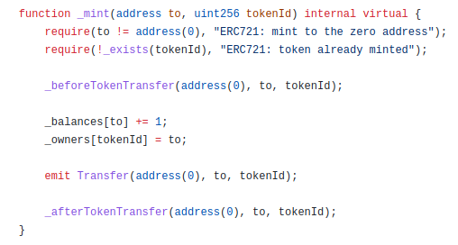

## Lesson 11: NFTs

NFTs are hot right right now.NFTs also known as `ERC-721s` are a token standard that was created on the Ethereum platform.NFT stands for `Non-Fungible Token` and is a token standard similar to ERC20.Again ERC20s like LINK, AAVE, MAKER all those goodies that are found on the Ethereum chain.An NFT is a token that is non-fungible.This means that they are starkly unique from eachother and one token isn't interchangeable with any of the token of it's class.A good way to think about is one dollar is interchangeable with any other dollar.One dollar is going to have the same value of another dollar.Those are fungible tokens.That's like ERC20s(Technically ERC677).One LINK is always going to be equivalent to one other LINK.

By contrast is going to be NFTs like Pokemon.Your one pokemon is going to have different stats, different move sets and isn't interchangeable with any other pokemon or more relatable is unique piece of art like Picasso.That's what these NFTs are.They are non-fungible, non-interchangeable tokens that for the moment are best represented or thought about as digital pieces of art that are incorruptable and have a permanent history who's owned them, deployed them etc.

Now like I said NTFs are just a token standard.You can actually do them much more than just be art.You can give them stats.You can make them battle.You can do really unique things with them.You can do pretty much whatever you want with them but right now the easiest way to think about it and the most popular way is by calling them art or some type of collectible or just anything that's unique.

They've been getting ton of buzz recently because we've been seening more and more these being sold at insane prices like we saw AXIE INFINITY sold nine plots of their unique land for $1.5 million.We also saw the original creator of the NEON CAT sold for like 300 ETH.Like I said they're just tokens that are deployed on a smart contract platform and you can view them on different NFT platforms like [opensea](https://opensea.io/).This is the NFT marketplace that let people buy and sell them.You obviously can do that without the marketplaces because it's a decentralized but they help and give a good UI.So that's the basic gist of it.

**ERC-721**

The ERC-721 standard or the NFT standard this is the basis of it all.There's another standard that's semi-fungible tokens the `ERC-1155`.We're not gonna talk about that here but you can check it out.The main differences between a 721 and ERC20 are ERC20s have a real simple mapping between address and how much that address holds.

721 has unique token ids.Each token id has a unique owner.

In addition they've what's called a token URI which we'll talk about in a minute.

Each token is unique.Each token id represents a unique asset.So since these assets are unique, we want to be able to visualize them and show what they look like.We need to define those attributes of the object.If it's a piece of art, we need to define a way to define what that art looks like.If it's some type of character in game, we need a way to define that character's stats in the NFT.

**Metadata**

This is where metadata and token URI come in.So if you know anything about ethereum, you know that sometimes gas prices gets pretty high.Especially when it comes to storing a lot of space, it can get really really expensive.So one of your first question might be "Are they storing these images and these art pieces on chain?" and the answer is sometimes.Back when they're coming up with NFTs and artists were deploying stuff, the ETH devs and the artists realize that if they put all this art on chain it's gonna be incredibly expensive.So to get around this what they did put in the standard what's called the token uri.

**Token URI**

Token URI is a universally unique indicator of what that asset or what that token looks like and what the attributes of the token are.You can use something like a centralized API or IPFS to actually get the token URI.A token URI is just a simple API call.

Typical token URI has to return something in the below image format.It has name, image location, desription and any attributes below.The image URI is a seperate URL that points to an image.

Your first question probably be "We pull from a single source seems pretty centralized"This is the current limitation of the NFT ecosystem.There's often this talk of on-chain metadata vs off-chain metadata because it's so much easier and cheaper to store all your metadata off-chain.A lot of people use something like `IPFS` that is decentralized but does take a little bit of centrality to keep persisting but they can also use their own centralized API.However if that goes down then you loose your image you loose everything associated with your NFT.Because of this most NFT marketplaces actually can't and won't read off on-chain attributes or on-chain metadata because they're so used to looking for the token uri.

Obviously if you do off-chain metadata, you can't do anything really cool or interesting or have any games with your NFTs.For example if you wanted to create an on-chain pokemon game, all your attributes would need to be on-chain in order for your pokemon to interact with eachother because if it was off chain then that becomes alot harder to cryptographically prove.So if you're new with NFT and you're like "wait this is kind of like lots of information", I'll make it easier for you.

IF you're looking to render an image of an NfT
- add your image to IPFS
- add a metadata file(token URI json) pointing to that image file on IPFS
- then grab that token URI and put it and set it as your NFT

The [chainlink dnd article](https://blog.chain.link/build-deploy-and-sell-your-own-dynamic-nft/) does a great job of walking you through this and showing you how to do this.Be sure to read that if you're looking to learn how to do that.

**Let's start coding**

There are two different types of contracts that we're going to be working with.We're gonna be first working with a simple collectible and then we're gonna work with an advanced collectible.The simple collectible is going to be a very simple ERC721 standard.We're not gonna really add any bells and whistles other than give it like a name.Then our advanced collectible is going to take advantage of some of those more advanced true scarcity features that we're talking about.So protocols like avagochi and ethercards use chainlink vrf to get verifiably random numbers to create verifiably scarce nfts.Something that's important to keep in mind is that `in the real world when companies create trading cards there's no way to prove how scarce or how valuable these trading cards actually are.If we use a verifiable random number then whoever is deploying these NFTs can't even control how rare there NFTs really are`.So we get this scarcity and rarity which adds some value to the tokens.

If you want to just go ahead and work right from the brownie-mix you can absolutely just run `brownie bake nft-mix`.We're gonna go through and deploy and develop everything from scratch because we're gonna actually take some previous concepts that we've learned, improve on them and we're gonna learn alot of nitty gritty interesting pieces about making this hybrid smart contract because these NFTs really are a perfect example of a hybrid smart contract.They've some off-chain component interaction with a random number and restoring their metadata with IPFS and I'll explain IPFS a little bit more in depth as we go on.

**Initial Setup**

So let's go ahead and get to it.I'm gonna go ahead and make a new directory called NFT and open the folder in VS code.First step we're gonna do is `brownie init` to create our blank brownie repository.

**SimpleCollectible.sol**

Let's go ahead and create our first contract.We'll call this SimpleCollectible.sol.Since this is going to be a simple collectible a simple NFT that we're gonna get started with.Now similar to ERC20, this [ERC721 standard](https://eips.ethereum.org/EIPS/eip-721) has a nummber of functions that we can actually work with.

Once again instead of us kind of recoding copy pasting all this from scratch we're gonna be using open zeppelin's ERC721 [documentation](https://docs.openzeppelin.com/contracts/3.x/erc721) for this.We're gonna be working with version 3.x.There's a version 4.x that has come out.Using version 3.x of their open zeppelin contracts is also a little bit easier to explain but again those who want to challenge yourself definitely try their 4.x version.So let's go ahead and jump right into it.

First we'll SPDX license identifier then we'll choose our solidity version.Then we're gonna go ahead and look at the open zeppelin ERC721 documentation and we're gonna go ahead and grab importing ERC21 line.

`import "@openzeppelin/contracts/token/ERC721/ERC721.sol";`

You're can even see a sample ERC721 that they give you and it's going to be similar to the ERC721 that we're gonna make.We go ahead and paste that line in our code and ofcourse since we're doing @openzeppelin/contracts, we're gonna need to create our brownie config and same as always we'll add dependencies.

Let's even try to just compile this right now.

`brownie compile`

Similarly to our ERC20 that we did with open zeppelin, we're gonna do the same startup here.

This is how we're going to inherit all of those functions in the ERC721 token standard here and we can start coding our simple ERC721.Now for our ERC721, we're gonna make it be a couple of cute adorable cats.You can use any image that you want for this course however if you wanna follow along with me, you can download the image, create folder inside your NTF directory called img and add that image to that folder.The image is going to be the NFT that we're gonna deploy.We're gonna deploy very simple cat for our smart contract.Let's go ahead and create the rest of the contract for the image.

First thing we're gonna make is our constructor, it's going to take no input parameters which is going to be a public constructor and then we're gonna go ahead and use the ERC721 constructor which if we look at the documentation we give it a name and then a symbol.We're gonna use the ERC721 constructor parameters which is gonna to name which we're gonna say is Chase and symbol is CHA.

That's all we really need to do for the first part.

**Factory Contract**

This NFT contract is actually what's known as a `factory contract`.There's a main contract and in it, it has a list of all the NFTs and the owners that are of this type of NFT.So in this example all the type of NFT is just gonna be this cat and we actually need a function to mint new NFTs based off of this cat.Now we can absolutely have an NFT factory contract that only creates one single NFT but we're gonna use this factory implementation to create multiple NFTs.

This is different "factory" pattern than what we did with SimpleStorage.We make many NFTs, but they are all contained in this one contract.We're gonna do it with a function called "createCollectible".This will create a new NFT and assign it to whoever called this function.So anybody can come here and create a new cat for themselves or in other words adopt a cat.

When we create this collectible all we're going is we're assigning a new token id to a new owner and if we look at the [open zeppelin ERC721 github](https://github.com/OpenZeppelin/openzeppelin-contracts/blob/master/contracts/token/ERC721/ERC721.sol), we can see they've _safeMint function.

**_safeMint**

This is the function that they use to mint or create a new NFT.This function takes a new address to which is going to be the new owner of the NFT and a token id.Every NFT in this factory contract has a unique token id.We're gonna have our token ids start from 0 and just increment every time we have a new token minted.

This _safeMint function called another _safeMint function which calls _mint function.So if you're looking at the code, the _mint function is really the function that calls and creates the NFT.You'll see actually they just have two mappings that they update.

They update this owner's mapping which is just the mapping of token ids to the owners of the token ids and then they update the balances which is a mapping of owner address to the token count.So the number of tokens that an owner actually has and that's all that's happening when we call this _mint or in our case _safeMint function.

The difference between _safeMint and _mint is _safeMint checks to see if a token id has already been used or not and this way we don't actually override who owns tokens and who owns token ids.So we're going to be using the _safeMint function.

