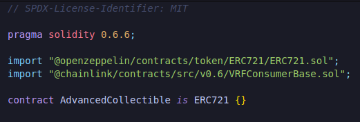
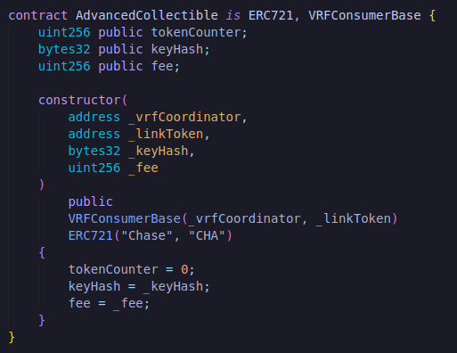
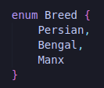

**Advanced NFT**

Let's go ahead and create a new file in our contracts "AdvancedCollectible.sol".What we're gonna do here is we're gonna make again an NFT contract, token URI can be one of 3 different cats.When you mint NFT you'd get random image from your image directory.I'm not going to go over stat generation and like creating battling NFTs or really games out of these but if you wanna see a version of those contracts check out this [repo](https://github.com/PatrickAlphaC/dungeons-and-dragons-nft) to see and it actually creates characters that can do battle and have like stats and attributes like attack.The repo is done with truffle as opposed to being done with brownie but all the contracts are going to be the same other than migration.sol.

Since we're gonna work with chain-link VRF to get a provably random NFT, we're also importing VRFConsumerBase.

We're gonna go back to config and add chainlink in our dependencies.

Our AdvancedCollectible is ERC721 and VRFConsumerBase.

So same as always let's go ahead and start with the constructor.We knoe from our lottery smart contract that we're actually wanna parameterize alot of the pieces for working with the VRFCoordinator for working on different chains and testnets.We can always head to [chainlink docs](https://docs.chain.link/docs/get-a-random-number/v1/) to get a random number just in case we forgot what some of the parameters are.

**Double Inherited Constructor**

Of course we need to do the VRFConsumerBase constructor and the ERC721 constructor so:

We know we're also gonna need to do tokenCounter(looking from SimpleCollectible.sol).

We're gonna need a keyHash and fee too.

This is a combination of alot of stuff we did in our lottery smart contract and some of the pieces that are from ERC721.We need the keyHash, fee, vrfCoordinator and linkToken all for the VRFConsumerBase and we need "Chase", "CHA" and tokenCounter for ERC721.So now we're gonna create our function createCollectible.

This time in our python script we're actually gonna define where we're getting tokenURI from.Remember way back in our lottery when we did `event RequestedLotteryWinner` when we called the chainlink VRF, 

we're gonna do a similar thing here where we're going to make an event for whenever we request one of these new cats and that is also what we're gonna return.We're gonna return that requestID here.

Since we're using the chainlink VRF, we can go ahead and call that requestRandomness function.

This function is imported from ERC721 and then in that request and receive model it's going to call back with our fulfill randomness function.We're gonna need to do couple of different things here because we want the user who called createCollectible to be the same use who gets assigned the tokenID.

This is going to create our randomness request to get a random breed for cats.Let's go ahead and define a little bit of fulfill randomness function so we can figure out how we're actually going to pick a random cat.

Well the first thing we're gonna need is some definition of what the different breeds that the cat can actually be and again similar to lottery we're going to create a new type called breed using the ENUM. 

So our breed is going to be one of these three breeds.Don't mind with the breed I just wrote randomly.It has no relation with the pictures.

In our fulfillRandomness when we get that random number back, we can use that random number to pick one of these three breeds.

Making it internal so that only VRFCoordinator can call it and we're selecting based off of a random number.

**tokenIDToBreed**

However we do need to assign this cat_breed to it's tokenID.Now that we've a random breed back, How do we actually go ahead and assign this? Well we're gonna have to create a mapping to do this.We need to get our tokenID somehow and equal it to cat_breed.So our first question is inorder for us to assign cat_breed to tokenID, How do we actually get the tokenID?

Well we're gonna grab the tokenId by:

We need to make tokenIDToBreed mapping up on our code.

This way each tokenID is going to have a very specific breed based off of this mapping's results.

What else do we need in this fulfillment?We need to mint the NFT and set a token URI.Well when we minted before we called _safeMint function.However msg.sender is always going to be the VRFCoordinator.Since the VRFCoordinator is actually the one calling fulfillRandomness so we can't actually have msg.sender as a parameter.We need to figure out how we can get the original caller of createCollectible.How do we get original msg.sender of createCollectible? 

Well the answer is actually going to be another mapping.When we call createCollectible , we can create a mapping of requestID to sender.

We're going to create this new mapping at the top.

