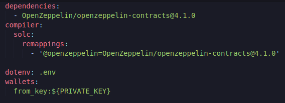

Now that we know alot more about upgrades and how they actually work and some different methodologies behind them.Let's go ahead and learn how to actually implement some of these strategies and implement our contract so that we can upgrade them.

There's a brownie upgrade mix directly in the brownie mixes organization that if you want to use, you absolutely can.Once again to do that it's:

`brownie bake upgrades-mix`

This will have all the code that we're going to teach you how to use right now. 

**Coding Upgradeable Smart Contracts**

But let's go ahead and build this up from scratch ourselves.

`brownie init`

We're going to be using the open zeppelin's proxy contracts to actually work with this and run with this.The methodology that we're going to be working with is "TransparentUpgradeableProxy.sol".Now they've been using the Universal Upgradeable Proxies a little bit more however the Transparent Upgradeable Proxy is really fantastic and easy to understand.So that's going to be the one that we're going to be working with here.

**Box.sol**

We're going to create a really simple contract that we can easily tell if it's upgraded or not.We're going to be using the exact same ones that open zeppelin actually uses.So let's create a new file "Box.sol".We're just going to have store and retrieve some type of value.For this we're going to be use 0.8.0.Oftentimes you're going to have to quickly pick up new versions of solidity anyways.

Now we're going to copy all of this code and create a new contract called "BoxV2.sol".We're going to paste it in and BoxV2 is going to be exactly the same except we're going to add one more function called increment.

This is going to be really easy for us to check to see is a contract has been upgraded or not.If we can call increment on the same address that we originally deployed box to then this means that the contract has been upgraded.we shouldn't be able to call increment on the Box.sol but we should be able to call it on BoxV2.sol.

**Getting Proxy Contracts**

To actually work with the proxies and the transparent proxy that we're going to be working with, we do need to add them to our brownie project.So we're going to create a new folder inside contracts called "transparent_proxy" and we're going to add "ProxyAdmin.sol & TransparentUpgradeableProxy.sol".We're going to grab all the code from the open zeppelin's [proxy contract](https://github.com/OpenZeppelin/openzeppelin-contracts/blob/master/contracts/proxy/transparent/ProxyAdmin.sol).

Since this code is pulling directly from open zeppelin package, we're going to have to fiddle with the imports a little bit to make a match so brownie can actually compile it and of course since we're going to be working with another package, we've to add the dependencies to our brownie config.

We can now just have this be:

We don't need to change at all for TransparentUpgradeableProxy.sol because we're actually going to keep this [TransparentUpgradeableProxy.sol](https://github.com/OpenZeppelin/openzeppelin-contracts/blob/master/contracts/proxy/transparent/TransparentUpgradeableProxy.sol).

And same thing with the import of TransparentUpgradeableProxy.sol file.

Now if we've done this right we should be able to run :

`brownie compile`

If you get this error :

You got to change the contract of BoxV2.sol to BoxV2.

 
