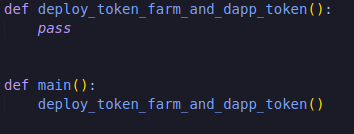
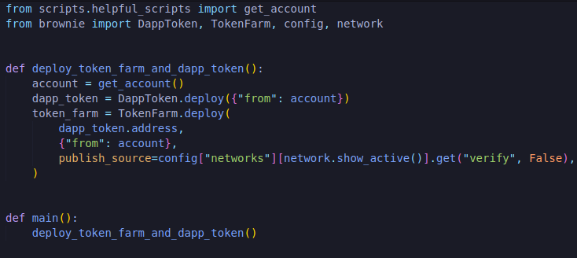
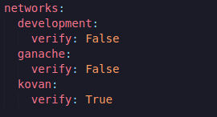
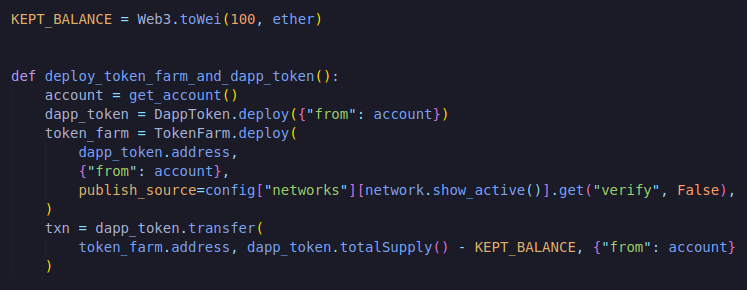

All we've to do now is add some way to unstake the tokens.Let's go ahead and create this function.

**unStakeTokens**

First thing we're going to do is fetch the staking balance.How much of the token does the user have?

Once we actually transfer the token, we'll do :

Because we're going to transfer the entire balance here and then we're going to update how many of those unique tokens that they have.

**Can this be reentrancy attacked?**

Quick note here.Later on we're going to learn about `reentrancy` attacks.So at some point come back here and figure out whether this is vulnerable to reentrancy attacks.

Now the last thing we could do is we probably should actually update our stakers array to remove the person if they no longer have anything staked.This is a little bit sloppy but we're just going to skip doing that for the time being however if you wanna go back and add the functionality to remove the stakers list as they unstake.It's not a big deal if we don't actually do this because our issue tokens function is actually going to check to see how much they actually have staked and if they don't have anything staked then they're not going to get sent any tokens.

That's basically all of the functionality here.Let's just try quick sanity check with a brownie compile. 

Just because it's compiling correctly though doesn't necessarily mean that we're doing everything correctly.Typically now we'd want to go ahead and start doing our tests.

**Scripts and Tests**

I'm actually gonna go ahead and build one of our scripts first.The reason I'm going to build on of the scripts first is because I'm going to use my deploy script pretty regularly in my test.I'm going to use it as part of my testing.This way I can also test some of my scripts as well in addition to the contracts.So let's go ahead and make our deploy script and __init__.py.

First thing we're going to do as always is get our account and I'm going to copy couple of those helpful scripts from our past projects.

Now we're going to want to start deploying some contracts.We're going to deploy that Dapp token first.

Then we're going to deploy our token farm which takes dapptoken address.

And in our config, we'll do:

Once we've deployed the tokenfarm contract, we need a couple of things.We're going to need to send this some dapp tokens.We're going to send pretty much all the dapp tokens so that I can actually give those tokens out as a reward.

We're going to keep 100 dapp tokens from the total supply so we can do some testing just in case.

Now we're sending our token farm basically 99.9% of the total supply of the dapp token so that it has token to actually give out as a reward.

If we look at our TokenFarm, we know that our stakeTokens function, we can only stake tokens that are allowed.In each one of these tokens also is going to need to have some price feed associated with it in our tokenPrice.So we're going to add those.

What we're going to do is create a function called add_allowed_tokens and is going to take couple things.We're going to want to take that token_farm because we're going to need to call the allowedTokens function on it.We're going to take a dictionary of allowed tokens and it's going to be a dictionary of different token addresses and their associated price feeds.So we're just going to price everything in USD so we can figure out the value of everything in USD and the last we're going to need an account.

Let's look at the different inputs that we're going to put into the function.So obviously we're going to do token_farm but then we're going to need to make the dictionary of allowed tokens.We're going to need the address of the different tokens that we want to have.`How do we get the addresses of the different tokens that we're going to use and what are the tokens that we're even going to use here?`

For simplicity we're just going to start with three tokens.We're going to allow our platform to allow three different tokens to be staked.We'll use the dapp_token weth_token because that's pretty much standard in most smart contract platforms and then we're also going to use and fau_token which stands for faucet token and we're going to pretend that this faucet token is DAI.The reason that we're going to use the faucet token is because there's the [ERC20 faucet](https://erc20faucet.com/)which allows us to get the fake faucet token.We can get unlimited amounts of faucet token on different test nets.We're going to pretend that the faucet token is going to be DAI.

So how do we actually get these addresses?Well dapp_token we know, weth token what we can do in our config so can actually add those addresses there.

`weth_token: '0xd0a1e359811322d97991e03f863a0c30c2cf029c'`
 
 `fau_token: '0xFab46E002BbF0b4509813474841E0716E6730136'`

We could grab the address from config and always get from our config.Or we could use our get_contract method that we grab from our helpful_scripts which will deploy a mock weth_token which doesn't exist in config networks.That's what we want because we're going to want to test this locally so we're going to deploy our own fake weth_token.So we'll say:

What we put in `get_contract("weth_token")` here, our string that we put there, needs to match our string in our config.Now in order for get_contract to work for weth_token and fau_token, we're actually going to have to modify our helpful_scripts here.So if we copied and pasted it directly from our chainlink-mix, we're going to have : We're importing all of our mocks which we can go ahead and copy paste these as well from chainlink-mix; test for our mock contracts, forking implementation, contract_to_mock which tells us based off of the key what token or what contract we use to mock, get_account which we use all the time.

