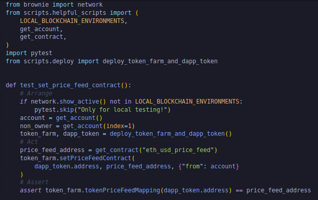
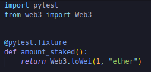
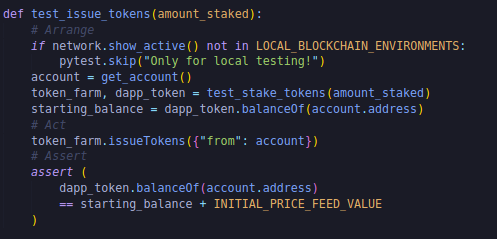

Well ofcourse we want to run some tests.We want to make sure our contract is actually going to do what we say it's going to do.

**Testing**

So in our tests let's make a new folder called "unit".We'll add a new file call "test_token_farm.py".Now ideally we'll also write some tests for our dapp_token however we're going to skip over those because we're basically just doing open zeppelin's implementation.But in a full-scale production here, you probably would want to write some tests on your tokens as well.So let's get into this.

Let's look at our token_farm and see what we need to test.Remember ideally every piece of code in our smart contract here should be tested in some form or another.So with that in mind let's get started.So one of the first functions that we see is setPriceFeedContract.So let's make a test for that.

Well first let's make sure we're on a local network because we only want to be doing this on our local network.Since this is one of our unit tests.

We're going to get an account to make the transactions.Let's even grab a non_owner account which we'll use to check some onlyOwner function.Then we're going to get the token_farm and the dapp_token based off of our deploy script.

We're going to do this arrange step alot for all of the tests.This is how we're going to set them up.We could even hypothetically turn this into a conf test or into a wraper but we're just going to leave it here like this for now.

Now let's move on to our act phase.

If you try to set a contract as an address parameter like `address _pricefeed`, brownie will know you're looking for an address instead of an actual contract.

If we check our price feed mapping, it should now be updated.

alright that's our first test.Let's run it.

`brownie test`

Now let's also do a test to make sure that non_owners can't call the setPriceFeedContract.We want to make sure that somebody other than the owner who deployed it because deploy_token_farm_and_dapp_token is going to be run by get_accout.We want to make sure that somebody else can't call the setPriceFeedContract function.

We can sleep easy that setPriceFeedFunction is going to work as we intended.

Let's write some tests for issueTokens.In order to test issuing tokens, we actually need to stake some tokens first.For now I'm just passing the test and before we test issuing the staking tokens, we need to write a test for staking those tokens.In order to issue tokens, we need to have some tokens stake.So let's write a test stake tokens first and then we'll write test issue tokens.

The initial bit of test(Arrange) is going to be exactly same.Making sure we're on local network, getting the account and deploying token farm and the dapp token.Now let's move onto act phase.Let's actually send some tokens to our token_farm.So first we obviously need to call approve on the dapp_token contract.

Now I put a question mark there because we're going to constantly be using an amount.We're going to be using amount staked for alot of our tests.So we're actually going to turn that into a fixture.

and we're going to define it in our conftest.py file.In our conftest.py, we're going to create our first fixture.

Now we can use the amount_staked fixture as basically a static variable.Pytest and brownie will automcatically grab all the fixture from conftest and pass it onto our testing.We can just use amount_staked as a parameter in our test.

Once we approve, we can do:

If we go to our TokenFarm, we've the mapping called stakingBalance which is a mapping of a mapping.we need to pass actually two variables.First address and second address to get the amount.That is how we do syntatically in above code with brownie.You just pass it as additional parameters.

We can even run this by `brownie test -k test_stake_tokens`

We still have other assertions to make because if we look at our stakeTokens function it does lot of things.So let's check all of it to make sure that they all are working correctly.

This is going to be the first token so unique token staked should be 1 and stakers at 0th index should be the account that we're using.we update our unique token stacked, update our staking balance, then we push the msg.sender in our staked.So we're going to be the first address in the array.We'll be returning token_farm and dapp_token because we can use it in some of the other tests.

Now we're moving into test_issue_tokens phase here and we're going to use test_stake_tokens.We're going to grab the amount_staked and place it as a argument in test_issue_tokens and we're going to set this test almost exactly the same way.

So to test issuing tokens to issue the reward, we want to first take some inventory of current starting blanaces of our address.

In our assert, dapp_token account address balance should be equal to starting balance + some new amount.What that some new amount going to be?Well of we look at our issueTokens function, if we're staking in our conftest, we're staing 1 ether or 1 DAI because we're staking the dapp_token, we're just staking 1.Our mocks is going to be the eth_usd_price_feed or MockV3Aggregator when we deploy it, the initial value is going to be 2000.We're saying in our mock, in our test sample, we're staking 1 dapp_token which is equal in price to 1 ETH.So we should get 2000 dapp_tokens in reward.Since the price of eth is $2000.

Little bit of math here.The initial value is 2000 and our application pays us reward based off of the total USD value that we've locked.So we actually can know that `???` is going to be 2000 price.In our test we could import INITIAL_PRICE_FEED_VALUE from our helpful_scripts and we can just assume that our starting value is going to be starting balance + that initial price feed value.

If we've done all our math correctly and if we've done our issueTokens and our getValue correctly this should work.

`brownie test -k test_issue_tokens`

