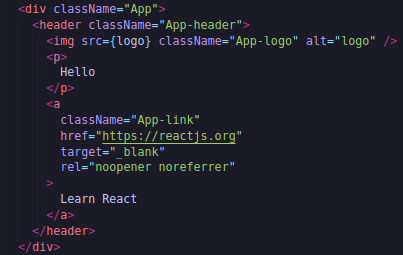
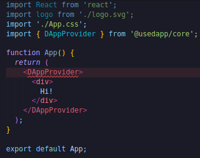
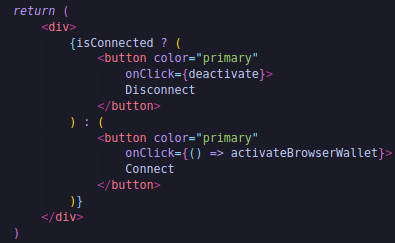

## Front End / Full Stack

Now that we've got the contract work, we're going to learn something totally new that we haven't covered yet.We're going to learn to do some front end development.This isn't a front end course and the focus isn't going to be on front end.Undestanding how these font end applications work is really helpful and it'll give you a massive incredible skill to actually build front ends for your smart contracts.Having a really solid user interface is really important in the web3 and the blockchain world.If people can't use your contracts then what good is your application.So with that being said let's jump on and let's build our front end.

**React and Typescript**

We're going to be working with `typescript` here which is a improved version of javascript and catches a ton of the different bugs and allows us to be much more explict with how we're working with our front end.We're also going to be working with react.We're going to be working with `create react app`.This is a front end framework that allows us to quickly spin up a front end to build for our applications.We're also going to be working with `useDapp` which is a framework for rapid dapp developent and works great with react.So let's get started building the front end.

**create react app**

First thing we're going to do to build a front end for our full stack application is create react app boilerplate.So you should have npx install.Run npx --version and it should shows the versions.This should be installed when we installed npm.

**install packages**

If you don't have npx install you can run :

`npm install -g npx`

Additionally we're going to install yarn.To install yarn, you just run:

`npm install --global yarn`

Once you've those, we can actually create a folder with all of our boilerplate code in it.We're going to run:

`npx create-react-app front_end --template typescript`

For those of you who've never worked with typescript before and who've worked with javascript, don't worry the syntax is nearly identical.For those of you who've never worked with either, don't worry we're going to walk through everything that we do.

Now that we've downlaoded our create react app, we've the new folder called front_end.

Now typically what different applications will actually do is they'll have one repository for all their python and for all their contracts but they'll additionally have a different folder or different repository for their front end application and their front end work.This is really good practice.We're just going to bundle everything up into the same repo here just to get started and just to make it easier for us getting started here.

However what you'll see across different projects is they'll have a totally seperate repo for their front end.So let's take some inventory on what's actually going to inside the folder.

**Create React App Layout**

So the first folder you'll see is `node_modules`.These are basically the pip installs.These are the different packages pulled in from javascript and typescript.We can pretty much ignore this folder for the majority of what we're working with.

Next we've our `public` folder.We're also not really going to go in here but it's got some nice little images, basic index.html which has the html that we're going to be running with and has a `manifest.json`.The manifest is something that we want to change.It tells our browsers a little bit about what our app is and what our app actually does.So this is something that we'd change but everything in there is pretty self-explanatory and then roberts.txt which helps web searchers and indexers learn a little bit more about your site.

Most part we're not going to do anything in the public folder or the node_modules folder.

`Src` folder is however we're going to be spending alot of time in it.It has our App.css which includes whole bunch of formatting for html, App.test.tsx which is going to be testing our front end, App.tsx is one of our main places to write some code, index.css again a formatting and styling file.Anything that ends in css is some type of formatting and styling.All the tsx are going to be typescripts.

`package.json` tells our project what dependencies it needs and node.js packages.

`tsconfig.json` which gives us some options on how to work with typescript.

If you're unfamiliar with alot of stuff don't worry too much about it.

Now that we've created the basic create react app, we can actually go ahead and right now we can see what  front end will look like.

`cd front_end/`

`yarn` : just to make sure we've everything installed.It installs all of our dependencies.Anything in package.json, yarn is going to to go out and download these dependencies and store them into node_modeules and then yarn.lock is going to tell us exactly what it downloaded.

`yarn start`

If you wanna know where this's coming from, if you go in your package.json and you look under scripts:

These are the four different scripts that we actually run.Running yarn start runs this npx react-script start which will actually start our front end.After a little bit of time, we'll get something that look like:

This is a super simpler front end.Obviously this isn't at all what we're looking for but we've now started a front end.

We're going to stop the front for now by hitting `ctrl` + `c`.

We've a really basic setup for working with a front end.

**connecting your wallets**

If we look at an application like [aave](https://app.aave.com/), you'll see they've connect button that pops up and they've got some nice user interface tools for actually working with the blockchain.We don't have to reinvent the wheel and build all these custom tools for doing this.So we're going to use the application called `useDapp`.To get started installing all we have to do is run:

`npm install @usedapp/core`

This will install all the usedDapp pieces into our frontend so we can actually work with useDapp and not reinvent the wheel with working with wallets and working with ethereum and other smart contract applications.Now that we've that installed, we can actually go ahead and start building our front end now. 

We're going to go to App.tsx file and start adjusting some bits in there.We can do yarn start.We can go ahead and do something like change anything in there.Like the line `Edit src/App.tsx and save to reload.` to `Hello` then save it and recompile and display hello.

This is how we upload and update our front end.This is also our starting point for allowing our application to be web3 compatible.

So if we go to the useDapp [documentation](https://usedapp-docs.netlify.app/docs), we've a little example here that shows what something should look like.It's not exactly clear where we put all this code.So they've wonderful step-by-step bit.This is probably the most helpful bit here it says "The first thing you need to do is setup DAppProvider with optional config and wrap your whole app in it".So we're going to use DAppProvide tags to wrap around our app.

We can see the whole return thing in our App.tsx:

is our app.If we delete whole thing and save it, our front end is going to have nothing.The function App is getting exported to default App and it's getting rendered in `index.tsx`.But in any case we wanna wrap the whole thing with DAppProvider tag.

If we hit save we get the error like:

That's because the DAppProvider needs a config asscociated with it.We need to add the config bit into the DAppProvider.

First bracket says we're going to type in typescript and the second bracket is saying we're an object here.So in this config we're going to tell our application a couple of different things.We're going to tell it what suported chains there are, what are the networks that our application can actually work with.The default value for supported chains is going to be mainnet, goerli, kovan, rinkeby, ropsten and xDai.Since we're going to be testing only on Kovan and Rinkeby, we could just do:

If we wanted other chain ID, we could just go ahead and put in in there.If we wanted to work with our ganache we could just do 1337 or if we wanna work with random chain we can put other numbers there.And this is all we need to get started working with in a web3 blockchain compatible application.

We're going to spend lots of time in source folder and since we're going to be here lot, let's do some clean ups just to cut down on the amount of fat we've with that create react app.So App.css, App.test.tsx, logo.svg we're going to toss them.

**Header Component**

We're going to create a component.In react components are basically where you put modular parts of your front end and we're going to create one of these components is going to be our header component.To do this create a new folder inside scr called "components" and inside it create a new file called Header.tsx.This is where we're going to put our header stuff and we're looking to put a little botton up on corner.

Again if we look at the documentation real quick ,

This useEthers thing has got activate browser wallet thing and account thing.We're going to start by exporting constant variable.

This is some fancy typescript syntax which means Header is a function and what's the function gonna do.We're going to use this useEthers thing to get a couple variables.

In order for us to actually use these though, we need to figure out first if the user is connected.

So we're saying is the account is undefined, we're not connected.If it's not undefined then we're connected.We're literally just looking to see if there's an account here and whether or not we're connected we'll decide if we show a connect button or not.So to do that we're going to return some html stuff.

We're using the `?` which is knows as a tertiary operator which means if the account is connected we're going to do something and if it's false we're going to do something else.If we're connected we're going to create a button and we'll put deactivate function pulled from useEthers when we click the button and we're calling the button disconnect.This is what if account is connected does.

After colon(:) represents what we're going to do if it's not connected.We're going to show a different button and when click we're going to do a function of activateBrowserWallet and call the button as Connect.

So if we're connected, we're going to show a disconnect button and then if we're not connected, we're going to show a connect button.Save this and if we look at our UI nothing is changed.

Well why isn't anything changed? Well this component that we just made it's living inside of components folder and we've exported the header variable however it's actually not in our App function.If we look at our index.tsx, App is only getting rendered which we pulled in from ./App.So index.tsx is really our true ground zero.This is where everything really comes from.This is kind of our entry point.This is our main function you can kind of think that way that pulls from App file that we've.You can see we don't have any reference to header.We've our DAppProvider, div tag sying "hi" but we don't have the header in here.

So we need to import  the component we just made into our App.tsx.

Now we can take the header bit and place it inside our header tags.

