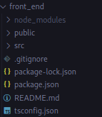
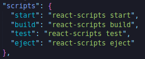

## Front End / Full Stack

Now that we've got the contract work, we're going to learn something totally new that we haven't covered yet.We're going to learn to do some front end development.This isn't a front end course and the focus isn't going to be on front end.Undestanding how these font end applications work is really helpful and it'll give you a massive incredible skill to actually build front ends for your smart contracts.Having a really solid user interface is really important in the web3 and the blockchain world.If people can't use your contracts then what good is your application.So with that being said let's jump on and let's build our front end.

**React and Typescript**

We're going to be working with `typescript` here which is a improved version of javascript and catches a ton of the different bugs and allows us to be much more explict with how we're working with our front end.We're also going to be working with react.We're going to be working with `create react app`.This is a front end framework that allows us to quickly spin up a front end to build for our applications.We're also going to be working with `useDapp` which is a framework for rapid dapp developent and works great with react.So let's get started building the front end.

**create react app**

First thing we're going to do to build a front end for our full stack application is create react app boilerplate.So you should have npx install.Run npx --version and it should shows the versions.This should be installed when we installed npm.

**install packages**

If you don't have npx install you can run :

`npm install -g npx`

Additionally we're going to install yarn.To install yarn, you just run:

`npm install --global yarn`

Once you've those, we can actually create a folder with all of our boilerplate code in it.We're going to run:

`npx create-react-app front_end --template typescript`

For those of you who've never worked with typescript before and who've worked with javascript, don't worry the syntax is nearly identical.For those of you who've never worked with either, don't worry we're going to walk through everything that we do.

Now that we've downlaoded our create react app, we've the new folder called front_end.

Now typically what different applications will actually do is they'll have one repository for all their python and for all their contracts but they'll additionally have a different folder or different repository for their front end application and their front end work.This is really good practice.We're just going to bundle everything up into the same repo here just to get started and just to make it easier for us getting started here.

However what you'll see across different projects is they'll have a totally seperate repo for their front end.So let's take some inventory on what's actually going to inside the folder.

**Create React App Layout**

So the first folder you'll see is `node_modules`.These are basically the pip installs.These are the different packages pulled in from javascript and typescript.We can pretty much ignore this folder for the majority of what we're working with.

Next we've our `public` folder.We're also not really going to go in here but it's got some nice little images, basic index.html which has the html that we're going to be running with and has a `manifest.json`.The manifest is something that we want to change.It tells our browsers a little bit about what our app is and what our app actually does.So this is something that we'd change but everything in there is pretty self-explanatory and then roberts.txt which helps web searchers and indexers learn a little bit more about your site.

Most part we're not going to do anything in the public folder or the node_modules folder.

`Src` folder is however we're going to be spending alot of time in it.It has our App.css which includes whole bunch of formatting for html, App.test.tsx which is going to be testing our front end, App.tsx is one of our main places to write some code, index.css again a formatting and styling file.Anything that ends in css is some type of formatting and styling.All the tsx are going to be typescripts.

`package.json` tells our project what dependencies it needs and node.js packages.

`tsconfig.json` which gives us some options on how to work with typescript.

If you're unfamiliar with alot of stuff don't worry too much about it.

Now that we've created the basic create react app, we can actually go ahead and right now we can see what  front end will look like.

`cd front_end/`

`yarn` : just to make sure we've everything installed.It installs all of our dependencies.Anything in package.json, yarn is going to to go out and download these dependencies and store them into node_modeules and then yarn.lock is going to tell us exactly what it downloaded.

`yarn start`

If you wanna know where this's coming from, if you go in your package.json and you look under scripts:

These are the four different scripts that we actually run.Running yarn start runs this npx react-script start which will actually start our front end.After a little bit of time, we'll get something that look like:

