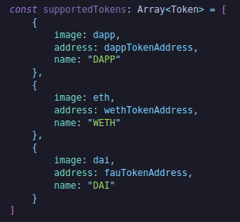
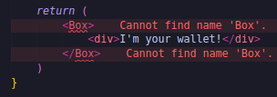
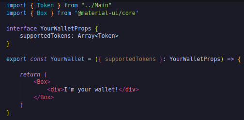
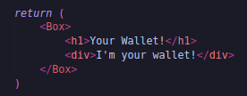
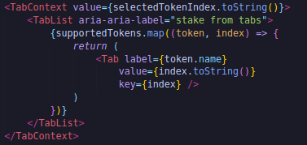

**YourWallet**

To do this we're actually going to make another component called your wallet.This component is going to be a part of this main component.It's a component inside of a component that is literally only going to address our wallet needs.So in our little components tab, we're going to create a new folder call it "yourWallet".We'll create a new file because we're actually going to make a couple files and our first one is just going to be "YourWallet.tsx".

This is going to be our component that's just going to deal with getting our wallet, getting the token balances of different tokens that we've.Since we know we're going to put this component in Main and Main is in our home base our App.tsx, you know that we're going to do an export YourWallet function.

In order to actually show these tokens, we do need to get some information from our other component.we need to get some information on what the supported tokens even are.So we're going to have our main actually pass a variable to our wallet.

Just to tell typescript what the supported tokens is going to look like we're going to say:

we're going to grab that token type from Main as well. 

and in our Main, we're going to pass the Token and some supported tokens to our wallet.So right underneath those three token addresses back in main we're going to do:

Above in the main we do export of type token.

So we're creating a new type called Token in our main function.We're creating supportedTokens which is an array of tokens and will be equal to array syntax.

So our first token is going to be have an image that we haven't defined yet, address is going to be dapp token address and the name is going to be dapp.Now we're going to need a couple images.So at this point you should see where we're going with this.we create this array of supportedTokens first is our dapp token and we need an image for the dapp token.Pop the image into src and name it dapp.png.

Now we can import this :

we can take the dapp image and under image I'll put it.
 

Now let's do the other tokens.

If you vs code is yelling at you about can't find module while importing image, we're going to do at the top of our code.

`/* eslint-disable spaced-comment */`

`/// <reference types="react-scripts"/>`

Save and that issue will go away.

Well now that we've our supported tokens token array, we can actually pass this to yourWallet bit.

Of course we need to import YourWallet.

We're actually going to make a new file in our yourWallet folder called "index.ts" and we're just going to export YourWallet.

Now we've some supported tokens, we have a wallet, exporting our wallet with our index.ts in our yourWallet folder.Now finish our YourWallet implementation.

We're getting this error:

because we don't have return in our YourWallet bit.

If you getting error like this:

It's because you're not inside front_end directory so it could found the dependency packages to start.

`cd front_end/`

`yarn start`

Let's keep diving into YourWallet here because this is gonna be where we're doing all of the stuff about what's in your wallet.We're going to use couple of components from the material UI to get started.To start we're just going to use the [box](https://mui.com/material-ui/react-box/).Box component serves just as a wrapper component for most of the css utility needs.It's a box that we can put on our front end.We're going to put everything in return statement inside the box.

We need to import the box.

We'll give box a little header.

We'll get rid of div tag and create another box and in there we're going to add all of our functionality for what is in our wallet.

We're going to use some `tabs` from the material UI to swap between the tokens.We're going to have one tab for fau token, another tab for dapp token and for wrapped ether we're going to use tab.So to work with tabs, we need to import some tab stuffs.

`@material-ui/lab` are some componenets that they're not quite ready to move to the core.So we do have to add these as well.

`yarn add @material-ui/lab`

Let's get into the box and make our first TabContext.The first tab that we're going to have to use is going to be whatever token we've selected.To select token, we're going to use what's called `State Hook`.

**State Hook**

We're going to create a state hook inside YourWallet.

It's going to create one variable selectedTokenIndex: this is going to do be whatever token that we're on and then setSelectedTokenIndex is going to update the selectedTokenIndex.The useState component thing is a way of saving state between renders of components.

So in our little box, we're going to start with our own tab.

Value is whatever token we currently have selected.We're going to have to make a list of tokens in our tab context.we're gonna have to add some way to change between the tabs.When we change between the tabs, we want different token to be selected and we're going to make a tab list that's going to change whenever we click different tabs.We're going to add some functionality to this but for now we're just going to give it an "aria".

Based off the suported tokens in a mapping of token to index, we're going to call a function where we return a tab.

Now if we look at our UI, we can now see we got a couple different buttons.

Now ofcourse if we click the different buttons, nothing actually happens.So we do need to handle a change.We do need to code some functionality to handle a change whenever we do something different.So in our Tab List we're going to add:

I'm going to code a little functionality at the top to actually handle a change.

We're going to use our little state hook here.

So what's happening here?We've added this new functionality where whenever we change on of those tabs, we're going to change the selectedToken.The selectedToken number is going to be different and what we do is map the indexes to a token.In our front end we can see we do indeed swap between tabs.

But we need a big stake button.The reason that we need to swap between the tokens is because we need a way to stake between them.So when we're on one of these tabs, we're going to add a stake form here.

**Stake Form**

We're going to add a big button that allows us to stake.

We're mapping that token and index again and in here we're going to return a different tab panel.

We're gonna need to put two pieces in here.We're gonna need to be putting our wallet balance and then also a big stake button.How do we actually get our wallet balance and one of these big stake buttons?Well we're probably going to need some type of component to get our actual wallet balance that we're going to stick in here.So yup you already know we're going to go into yourWallet folder, create a new file and this is where we're going to define wallet balance component "WalletBalance.tsx".

 and we're going to import our WalletBalance into our wallet in YourWallet.tsx so that we can actually see the balance of our wallet right in the front end.This is where we're actually be reading `off-chain` finally after alot of typescript and react setup.Since we're going to be importing WalletBalance into YourWallet component, we're going to start with export.

We're probably going to pass this the token, the token that we want to get the balance of.So we're even set it up like this:

and we'll define what it looks like with the interface called "WalletBalanceProps".

It's the same token type that we defined before in our Main.This is our initail set up here.We'll grab from the token that we've passed, we'll get the image, address and the name from that token.

We'll grab the account because we're going to need the account with along the token.

usedapp/core has a nice little hook called `usedTokenBalance` that we're going to use.It provides a way to fetch the balance of ERC20 tokens specified by tokenAddress.It makes our lives alot easier. 

All we have to do really is:

We can even do quick console.log to see if we're doing correctly and we take the WalletBalance and import it into YourWallet.we should be able to see something.

and down inside our very large return function, we'll add new component :

We do need to do a return in our WalletBalance function in WalletBalance.tsx so that it's actually a jsx component.

We want to show the token balance obviously in our UI.We don't want to have people to have to go to the console.log to actually see it.First we should probably format it because balance is in units of wei.

formatUnits is a nice little import that we're going to grab from ethers project.

