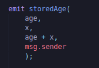

## Events and Logging in Solidity

**Events**

You've might have always wondered how chainlink or the graph or other off-chain protocols work under the hood.We're going to learn about logging and events in solidity, viewing those events on ether scan and working with them in brownie as well.

Now it's the ethereum virtual machine or EVM that makes alot of these blockchains tick like ethereum and the EVM has this functionality called a logging functionality.When things happen on a blockchain, the EVM writes these things to a specific data structure called it's log.We can actually read these logs from our blockchain nodes that we run.In fact if you run a node or you connect to a node, you can make a `eth_getLogs` call to get the logs.

Now inside these logs is an important piece of logging called events and this is the main piece that we're going to be talking about.Events allow you to "print" information to the logging structure in a way that's more gas efficient than actually saving it to something like a storage variable.These events and logs live in the special data structure that isn't accessible to smart contracts.That's why it's cheaper because smart contract can't access them.So that's the trade off here.We can still print some information that's important to us without having to save it in a storage variable which is going to take up much more gas.

Each one of the events is tied to the smart contract or account address that emitted the event in the transactions.Listening for the events is incredibly helpful.Let's say for example you want to do something everytime somebody calls a transfer function.Instead of always reading all the variables and looking for some to flip the switch, all you've to do is say "Listen for event to be emitted".Instead of writing some weird custom logic to see if the parameters changed at the certain time and some weird stuff like that.So a transaction happen an event is emitted and we can listen for these events.This is how alot of off-chain infrastructure works.

When you're on a website and that website relods when a transaction completes, it actually was listening for that transaction to finish.Listening for the event to be emitted so that it could reload or could do something else.It's incredibly important for front ends.It's also incredibly important for things like chainlink and the graph.

In the chainlink network, a chainlink node is actually listening for request data events for it to get a random number, make an API call etc.Sometimes there're way to many events and you need to index them in a way that makes sense.So that you can query all these events that happen at a later date.The graph listen for these events and stores them in the graph so that they're easy to query later on.So events are incredibly powerful and have a wide range of uses.They're also good for testing.

Now that we know what events are.Let's take a look at what they look like, how we can use them and how we might use them in our smart contract development suite.

Here's what an event is going to look like:

We've an event here called storedNumber.So we have basically a new type of event called storedNumber.We're saying "Hey smart contract we've this new event thing.We're going to be emitting things of type storedNumber in the future."When we emit this event, it's going to have these four parameters.It's going to have uint256 called oldNumber, uint256 called newNumber, a uint256 called addedNumber and an address called sender.You might have noticed there's another keyword in here.The `indexed` keyword.

When we emit one of these events, there're two kinds of parameters.There're the indexed parameters and the non-indexed parameters.You can have upto three indexed parameters and they're also known as `topics`.So if you see a topic, you know that's going to be an indexed parameter.Indexed parameters are parameters that are much easier to search for and much easier to query than the non-indexed parameters.In fact way back in the `eth_getLogs` function,it even has a parameter allowing us to search for specific topics.So it's much more searchable than the non-indexed one.The non-indexed ones are harder to search because they get ABI encoded and you've to know ABI to decode them.

Now this just told our smart contract that there's a new type of storedNumber, a new kind of event.We need to actually emit that event in order to store that data into the logging data structure of the EVM.To do that, we need to do something like:

It looks very similar to calling a function.So you call emit and then the name of the emit and then you add all the parameters in there that you like.Let's jump into brownie to learn how to use them in our smart contracts and access them with brownie.

We're going to create a new directory called "events" and open it in vscode.We're going to create a new brownie project:

`brownie init`

Let's grab the SimpleStorage.sol contract and put in our contracts directory.

