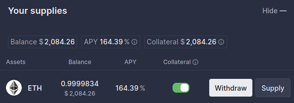
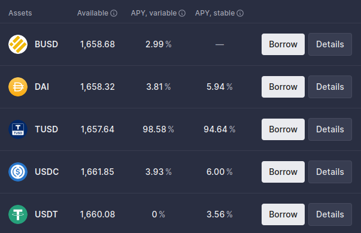
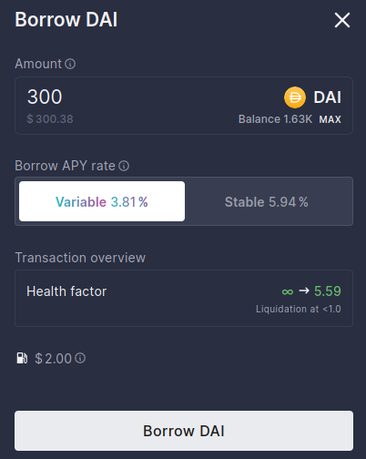
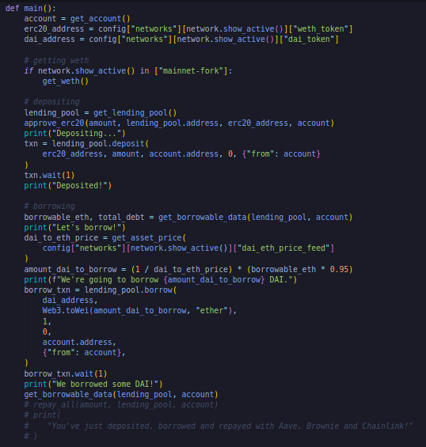
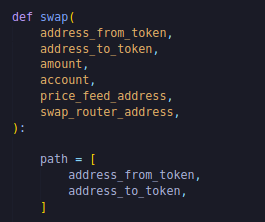
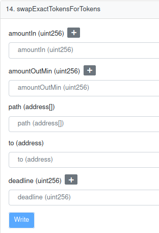
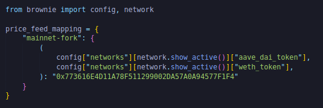
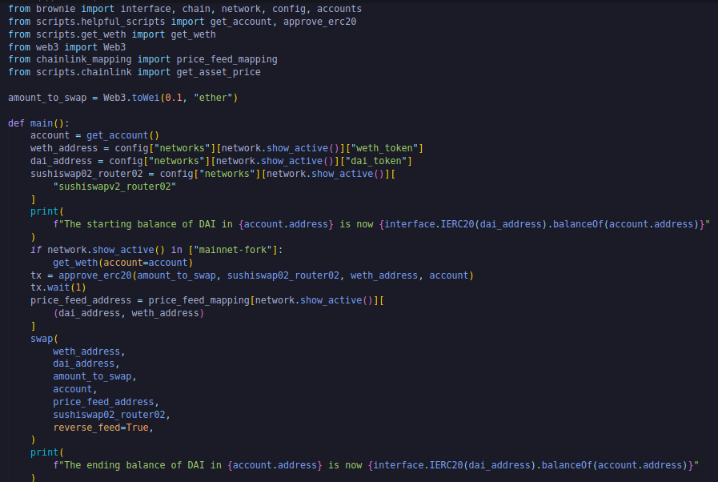

We're going to continue from Defi & AAVE of [Day16](https://github.com/spo0ds/Journey-to-become-a-Blockchain-Engineer/blob/main/Day16/Day16.md) and add more functionality to it.It's best suggested to look at day16 and then come over here.

## Leveraged Trading in DeFi 

When we're talking about leveraged trading or leveraged investing, it really just means we're borrowing some asset or borrowing some money so we can invest or trade more.It's "leverage" because we're using more than we initially start with and this is great because when you pick correctly you'll profit more but when you pick wrong, you'll loose more as well.

[`Margin trading`](https://www.wealthwithin.com.au/learning-centre/leveraged-trading/leverage-trading-the-pros-and-cons) and [`short selling`](https://www.investopedia.com/terms/s/shortselling.asp) are both types of leveraged trading because they both involve borrowing assets.In margin trading we borrow some cash or some assets so that we can go buy more and in short selling we borrow some assets so we can sell that asset in the hopes that the price of that actually goes down.You call it margin trading when you borrow some cash to buy something that you hope will go up.You call it short selling when you borrow some asset to sell it in the hopes that goes down.

Let's get into the demo into the [UI](https://staging.aave.com/).Everything that we're going to do here is going to work on mainnet as well.We need to get some [testnet ethereum](https://docs.chain.link/docs/link-token-contracts/) for Kovan and Rinkeby.In order for us to actually short sell or margin trade, we need to deposit some collateral.We need to deposit some collateral in order to borrow.This way we never repay back the loan that we took out or the amount that we borrowed.AAVE will just go ahead and take the collateral that we put in there.It'll do what's called a `liquidation` call and that's why it's a little bit safer than short selling in traditional markets because if your collateral is less than how much you've borrowed, you'll immediately get liquidated but you still lose a bunch of money.So like don't get liquidated.

In our UI, we wanna scroll to ethereum, connect our wallet and deposit the eth.

If we go to our dashboard, we could see we've some ether.

It's got some APY which is like the percentage return that we're going to get back for depositing into AAVE and we used it as a collateral.We can go ahead and borrow now.Whenever we borrow one of the assets, the APY is the percentage that over the course of a year that we're going to have to pay in order to actually borrow the asset.

So we're actually going to borrow some DAI because DAI is a stable coin.It's worth a dollar.In a way you could call this taking out the margin because we're taking out DAI to borrow and another way we could say we're shorting DAI.

You get to choose how much you want to borrow and you'll see health factor.Health factor is how close to being liquidated you're.This means how close we're to AAVE saying "We're taking your funds."If it goes below 1 at any time, somebody can liquidate you and take a lot of that deposit that we put in.There's some math behind what the health factor is.You can head over to the [AAVE documentation](https://docs.aave.com/faq/borrowing).

We're going to borrow 300 DAI and a variable APY.

After transaction completes, we're going to go to the dashboard and we can see:

This is basically the defination of margin.We could take this DAI and can use it to but other things.So all we really need to do now is sell this DAI for some other asset and we've essentially shorted DAI.

All we need to do is swap it.So if I grab my wallet address and go to Kovan etherscan and paste the address there.I could see:

We could see that I've got some interest bearing Ethereum and our DAI.

I could take the DAI and go to sushi swap and swap it.That's how you short it.You'll see you still have to repay at some point.

**Doing Programmatically**
 
In Day16, we forked mainnet, converted ETH to WETH(ERC20 version of ETH), approved our WETH to send it into AAVE smart contract, deposited it into AAVE smart contract and grabbed the DAI/ETH exchnage rate to figure out how much we can borrow, borrow it.

Now we're going to swap the DAI for more ETH on the sushiswap.This is essentially going to be short selling or buying on margin.So we going to approve selling it, grab the price because you need an oracle whenever you call one of the swapping functions.

So let's clone the whole code of day16 and we'll make some changes to it.

Let's first rename "aave_borrow.py" to "short_sell.py" and also comment out the repay function and make some slight changes.

Now here's where we get spicy.We short sell / buy on margin.Above script means we got some borrowed DAI.We have more money than we actually have.We have some debt now.We own some DAI.We can go ahead and take this DAI and buy some stuff.We actually need to swap it with some sort of swapper.

When you actually go to Uniswap and when you try to swap with the token, big swap button comes up.We're actually calling on of the [swap functions](https://etherscan.io/address/0xd9e1cE17f2641f24aE83637ab66a2cca9C378B9F#writeContract) like swapExactTokensForTokens, swapTokensForExactTokens, swapExactETHForTokens etc.We're calling on of these swap functions.Since we already swapped our Ethereum to Wrapper Ethereum, we're going to be doing `swapExactTokensForTokens`.We're going to say, "Hey we've this much DAI, give us at least this much of another asset back."

So we need to add this contract in our config file.

So first we're going to create a swap function in "swap.py" script.Swap is just us selling the DAI.

Swap function is going to take from and to address, amount, account, price feed address, swap router address and also reverse boolean in case of need.

First we need a path which is pool jumping path and it means we're going to go from DAI to WETH.

If there wasn't DAI WETH pool, maybe we'd have to jump a couple of different pools but for us this is all we really have to do.

Now interestingly enough whenever you call one of these functions, you actually need an oracle of some kind.So you need something like chainlink to get the price of an asset to actually call the swap functions.

We actually have to put in like amount out min and this is actually really important.Somebody could actually front run our swap and buy a whole bunch of WETH.Somebody could see one of our big transactions come in, buy up all the WETH and sell it back to us and they make a profit.So what we wanna do is we want to have amount out minimum that we say, "Hey if the transaction has less than this, we don't wanna do it" and to be safe we're doing 90%.Worst case scenario, this means we're having 10% slippage that means we're going to get a 10% worse price than we should.So ideally you want to do like 98% or something like that.

So amountOutMin is we're saying the minimum amount that we want back is going to be based off the price of wrapped ethereum or ethereum.

Then we've to give it an expiry time.Based on the chain, you get the current block number and then grab the timestamp and then we'll add 120 sec to give it 120 sec later.

then we grab the routerV2 from it's interface and can interact with it because it compiles down to the ABI.

We can grab the the 'IUniswapV2Router02' from the [contract code](https://etherscan.io/address/0xd9e1cE17f2641f24aE83637ab66a2cca9C378B9F#code).

then we call `swapExactTokensForTokens` function.

Which we're passing the amount that we wanna swap(amount), the minimum amount that we want back(amountOutMin), the pool jumping path(path), which account we're going to swap for(account.address), timestamp and then from account.Then we're going to wait for that transaction and return that transaction.

So we'll create a main function that's going to swap the tokens.First always we're going to need an account which we can get it using helpful_scripts get_account function.

Then we need to get the weth address, DAI address and sushi swap router address.

We'll print the DAI amount that we've in out account.

If the network is in mainnet-fork we're going to recieve 1 WETH in our account.

then we send the transaction for approval.

Approve ERC20 is going to approve the weth amount to the "to" address i.e sushiswap02_router02.

Now we're going to need the price_feed mapping for DAI address and WETH address.

also we need to make mapping in new file called "chainlink_mapping.py" same place where config lies.

You can get the mapping address from [here](https://data.chain.link/ethereum/mainnet/stablecoins/dai-eth).

Then we're going to call the swap function and at the end also print the DAI balance.

 

