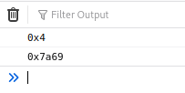
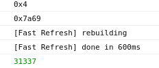

Back to our LotteryEntrance function.We just automated the process of updating our ABI's and then our contracts.Now we can import them into our files.We could import them at different line like `import abi from "../constants/abi.json"` or we could export them into the same file.So we'll create a new file inside components directory called "index.js" and in here we can import them and export them in one file.

```javascript
const contractAddress = require("./contractAddresses.json")
const abi = require("./abi.json")

module.exports = {
    abi,
    contractAddress,
}
```

Now we export them like this back in our LotteryEntrance, we can import them in just one line.

```javascript
import { abi, contractAddresses } from "../constants"
```

we can just specify the folder instead of each individual files because we've index.js which basically represents the whole folder.


**runContractFunction**

Back in our runContractFunction, let's uncomment and fill what we've.

```javascript
const {runContractFunction: enterRaffle} = useWeb3Contract({
        abi:abi,
        contractAddress: contractAddresses, // specify network Id
        functionName:"enterRaffle",
        params: {},
        msgValue://,
    })
```

How do we get the chainId and the msgValue?

ChainId is something that we can get easily with moralis.Once again we're going to import useMoralis hook from react-moralis.

```javascript
const {chainId} = useMoralis()
console.log(chainId)
```

The reason that moralis knows about what chain we're on is because back in our header component, the header actually passes up all the information about the MetaMask to the Moralis provider and then the Moralis provider pass it down to all the components inside those Moralis provider tags. 



This result is the hex version of our chainId.So chainId gives the hex edition of the chainId.

```javascript
const { chainId: chainIdHex } = useMoralis()
console.log(parseInt(chainIdHex))
```



Now the raffle address is something that we're actually going to use it alot, we might as well have it at the top of our code.We're going to be changing the raffle address.So we don't need to put it in a hook.We're going to be technically changing the address when we change networks but our header app takes care of rerendering and dealing with all that.

`const { chainId: chainIdHex } = useMoralis()` This line means pull out the chainId object and then rename it to chainIdHex.

```javascript
const { chainId: chainIdHex } = useMoralis()
const chainId = parseInt(chainIdHex)
// console.log(parseInt(chainIdHex))
const raffleAddress = chainIdHex in contractAddresses ? contractAddresses[chainId][0] : null
```

Now we've a raffle address and we can stick it on our function.

```javascript
const {runContractFunction: enterRaffle} = useWeb3Contract({
        abi:abi,
        contractAddress: raffleAddress, // specify network Id
        functionName:"enterRaffle",
        params: {},
        msgValue://,
    })
```

All we need now is the msgValue.If you remember back to our raffle we actually set that fee dynamically.We have i_entrance fee passed in constructor, so we wanna call the getEntranceFee function .This is one of the ways we send a transaction and also send functions.

One of the ways that we're going to do it is right when our lotteryEntrance loads, we're going to run a function to read that entrance fee value.How do we do that? Well we can use one of our hooks again.

```javascript
useEffect(() => {})
```

useEffect can run when something changes.We only try to get that raffle entrance fee, if web3 is enabled.So we'll pull isWeb3Enabled from useMoralis.

```javascript
const { chainId: chainIdHex, isWeb3Enabled } = useMoralis()
```

So in our function, we could say if web3 is enabled, we'll try to read the entrance fee.

```javascript
useEffect(() => {
    if (isWeb3Enabled) {
        // try to read the entrance fee
    }
})
```

We can use the useWeb3Contract wagan again.Let's go ahead and copy paste it and we'll use the same setup there.Except instead of enterRaffle, we're going to be doing getEntranceFee.functionName will also be getEntranceFee and msg.value nothing.

```javascript
const { runContractFunction: getEntranceFee } = useWeb3Contract({
        abi: abi,
        contractAddress: raffleAddress, // specify network Id
        functionName: "getEntranceFee",
        params: {},
    })
```

We're going to be calling the getEntranceFee function and now I'll show you how to actually call one of these in our contracts.Down in our useEffect, we're going to call useWeb3Contract.

Now if we just call getEntranceFee like this.
```javascript
if (isWeb3Enabled) {
            // try to read the entrance fee
            const entranceFee = getEntranceFee()
            console.log(entranceFee)
        }
```

If we look at our logs, we don't see anything.getEntranceFee is going to be an async function.Once again we need to do await getEntranceFee.But there's an issue:


well we can actually make an async function and stick these code inside the function.

```javascript
if (isWeb3Enabled) {
            // try to read the entrance fee
            async function updateUI() {
                const entranceFee = await getEntranceFee()
                console.log(entranceFee)
            }

            updateUI()
        }
```

Now if we go to our frontend, we still see nothing.Well isWeb3Enabled actually changes.So the first time the useEffect hook runs, isWeb3Enabled is probably is false but when it turns to true, we want to run the section.In our little dependency array, we're going to add isWeb3Enabled.The reason that it's false to start with is because of exactly what we showed in that manual header.Well in manual header, it first checks to see after we do a refresh, if `window.localStorage.getItem("connected")` then we call enableWeb3 which will make it enabled.So in our lotteryEntrance, isWeb3Enabled starts off as false when we do refresh and then the browser checks the local storage and says "Oh web3 should be enabled.Let's enable it." and turns it to true.

```javascript
useEffect(() => {
        if (isWeb3Enabled) {
            // try to read the entrance fee
            async function updateUI() {
                const entranceFee = await getEntranceFee()
                console.log(entranceFee)
            }

            updateUI()
        }
    }, [isWeb3Enabled])
```

Now if we hit refresh, in our console, we can now see a logged out entrancefee.


**useState**

Now we also want to show the entrance fee in our UI.So if we do `let entranceFee = ""`

```javascript
 async function updateUI() {
                entranceFee = (await getEntranceFee()).toString()
                console.log(entranceFee)
            }
            
return (
        <div>
            Hi from lottery<div>{entranceFee}</div>
        </div>
    )
```

If we hit refresh, there's still an issue here.We don't see entrance fee in the UI but we do see it in console.What's going on here?

Well useEffect is going to rerender our browser and that's what we want and isWeb3Enabled goes from false to true, our browser rerenders. But once we get our entranceFee, does our browser rerender?

No it doesn't because entrancefee is just one of these normal variables.So we want to actually change it from being just a normal variable to being a hook because entranceFee does get updated but it's not triggering a rerender.So we actually want to change it to being a `useState` hook.

```javascript
const [entranceFee, setEntranceFee] = useState("0")
```

entranceFee is going to be the variable that we call to get the entrance fee.setEntranceFee is going to be the function that we call to update or set that entrance fee and whenever that the entranceFee variable is set, we trigger a rerender from the frontend.And in our useState, we're giving a starting value.We're saying entranceFee is going to start with 0.

```javascript
async function updateUI() {
                const entranceFeeFromCall = (await getEntranceFee()).toString()
                setEntranceFee(entranceFeeFromCall)
                console.log(entranceFee)
            }
```

Now we can see that the entranceFee has indeed been rerendered.

Now to make it more human readable form, let's change it to ethers.

```javascript
return (
        <div>
            Hi from lottery
            <div>Entrance Fee: {ethers.utils.formatUnits(entranceFee, "ether")} ETH</div>
        </div>
    )
```

**Calling Functions in NextJS**

Finally we've the entranceFee and now use it to enter the lottery.For msgValue we're going to be use the entranceFee.

```javascript
const { runContractFunction: enterRaffle } = useWeb3Contract({
        abi: abi,
        contractAddress: raffleAddress, // specify network Id
        functionName: "enterRaffle",
        params: {},
        msgValue: entranceFee,
    })
```

We want to make our code that all works even if we're connected to supported chain.If we switch from hardhat to ethereum mainnet, we're going to get an error because we're calling getEntranceFee on an address that doesn't exist.So let's add a little button so that we can enter the raffle.Before we actually do that let's make sure that we can only call the function so long as there's actually is a raffle address.

```javascript
    return (
        <div>
            Hi from lottery
            {raffleAddress ? (
                <div>Entrance Fee: {ethers.utils.formatUnits(entranceFee, "ether")} ETH</div>
            ) : (
                <div> No Raffle Address Detected</div>
            )}
        </div>
    )
```

Now inside of the div where there's a raffle address found, let's add a button.
