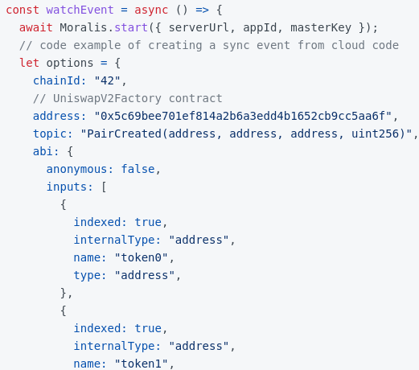
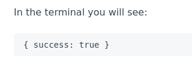
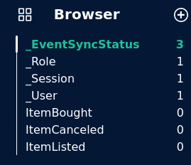
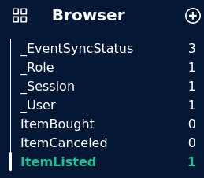

**Moralis Event Sync**

How do we tell our Moralis server to start listening for events? 

Well there's two way we can do this.The First way is with the User Interface.We could go to the sync, click on add a new sync and click on sync and watch Contract Events.We can manually add all our information there.

Or we could all do this programmatically.We'll create a script that can run to tell our Moralis Sever to watch for those events.We'll see that our database get upgraded to listen for those events.So back in our code, we're going to create a new file called "addEvents.js".

We come to the moralis [docs](https://docs.moralis.io/docs/moralis-sdk-setup), we can what it looks like.

To import the node extension of the moralis package into our script:

`const Moralis = require("moralis/node") `

We need to tell the same information that we need to fiil using User Interface.One of the first thing that we need is the address of our contract.The easy way is to grab the contract address from the terminal where we've ran hardhat  node or similar to raffle system, we could create the exact same thing here.

So back in our hardhat-nft-marketplace, in our deploy folder, we're going to create a new file called "99-update-frontend.js" and we'll create a little bit of deploy process that will automatically update our frontend.

```javascript
module.exports = async function () {
    if (process.env.UPDATE_FRONT_END) {
        console.log("Updating front end ....")
    }
}
```

In our .env if UPDATE_FRONT_END is true that's how we decide whether or not we actually want to update the front end.Then we'll create a function called updateContractAddresses which will update the contract address.

```javascript
async function updateContractAddresses() {
    const nftMarketplace = await ethers.getContract("NftMarketplace")

}
```

Then we want to write the file in some place in our frontend.For us we're going to create a new folder in frontend section called "constants" and create a new file there called "networkMapping.json".This will be the json object which keeps track of all of our deployments.

Now back in our deploy script, in the hardhat-nft-marketplace, we're going to keep track of that location.

```javascript
const frontEndContractsFile = "your location folder"
```

Now we've all that we're going to get the chainID. 

```javascript
const chainId = network.config.chainId.toString()
```

Then we want to read from networkMapping file to see what's currently in there.

```javascript
const contractAddresses = JSON.parse(fs.readFileSync(frontEndContractsFile, "utf8"))
    if (chainId in contractAddresses) {
        if (!contractAddresses[chainId]["NftMarketplace"].includes(nftMarketplace.address)) {
            contractAddresses[chainId]["NftMarketplace"].push(nftMarketplace.address)
        } else {
            contractAddresses[chainId] = { "NftMarketplace": [nftMarketplace.address] }
        }
    }
```

Now we've updated our contractAddresses object, we just need to write it back to the network mapping.

```javascript
fs.writeFileSync(frontEndContractsFile, JSON.stringify(contractAddresses))
```

Then at the bottom we'll export tags,

```javascript
module.exports.tags = ["all", "frontend"]
```

Now we can run just this updateFrontend Script with `yarn hardhat deploy --network localhost --tags frontend`

If we go back to our frontend, we now can see we've an entry of loca host with NftMarketplace with the address in our networkMapping.json.

We now have a networkMapping file with contract addreses based off of the chainId.We can pull that as well in our addEvents.js script.

```javascript
const contractAddresses = require("./constants/networkMapping.json")
```

To get the contract address based off of the chainID:

```javascript
let chainId = process.env.chainId || 31337
```

and we'll create a env variable for the chainId.

`chainID = 31337`

Now we can get the contract address based off of the chainId.

```javascript
const contractAddress = contractAddresses[chainId]["NftMarketplace"][0]
```

In our addEvents, we'll create a new function kind of similar to what we're doing.

```javascript
async function main() {

}

main()
    .then(() => process.exit(0))
    .catch((error) => {
        console.error(error)
        process.exit(1)
    })
```

If you go back to the moralis documentation though, we can see we need to grab our serverUrl, appId, masterKey and then start it up.

```javascript
const serverUrl = process.env.NEXT_PUBLIC_SERVER_URL
const appId = process.env.NEXT_PUBLIC_APP_ID
const masterKey = process.env.masterKey
```

We don't want our masterKey in the frontend so we're not going to put NEXT_PUBLIC like in url and appID.

Now the first thing that we're going to do in our main function is we're going to start the Moralis.

```javascript
async function main() {
    await Moralis.start({ serverUrl, appId, masterKey })
    console.log(`Working with contract address ${contractAddress}`)
}
```

Now we're going to add the sync for events that we want it to listen to.What are the events we want it to listen to? Well if we go back to the smart contract, we've ItemListed, ItemBought and ItemCancelled events.In Moralis they have `Add New Event Sync from Code` which we're basically going to be [following](https://v1docs.moralis.io/moralis-dapp/connect-the-sdk/connect-using-node#add-new-event-sync-from-code).To do this obviously, we need to start and create our options for the events.



Let's start with ItemListed Events.We'll create an option for ItemListed Event.First we need the chainID which we've from the env file.The first thing to point out about chainId is that `Moralis understands a local chain is 1337`.So even if you're on 31337, if you're doing a local development, you got to switch it to 1337.So we're going to make another variable called moralisChainId and set it using ternary operator.

```javascript
let moralisChainId = chainId == "31337" ? "1337" : chainId
```

```javascript
let itemListedOptions = {
        chainId: moralisChainId,
    }
```

What else do we need? We need sync_historical.It allows the node to go back throughout the blockchain, grab all the events ever emitted by that contract.Since this is a very small local blockchain, we'll set it to true.

```javascript
let itemListedOptions = {
        chainId: moralisChainId,
        sync_historical: true
    }
```

We'll add the address of the smart contract.

```javascript
let itemListedOptions = {
        chainId: moralisChainId,
        sync_historical: true,
        address: contractAddress
        }
```

We need the topic now.It's the event information.Topic is going to be the name of the event and the type of the parameters.

```javascript
let itemListedOptions = {
        chainId: moralisChainId,
        sync_historical: true,
        topic: "ItemListed(address, address, uint256, uint256)"
    }
```

We also need an ABI of just the event.Again we can find if we go back to the contract project and in the artifacts we'll have the ABI.

```json
abi: {
            "anonymous": false,
            "inputs": [
                {
                    "indexed": true,
                    "internalType": "address",
                    "name": "seller",
                    "type": "address"
                },
                {
                    "indexed": true,
                    "internalType": "address",
                    "name": "nftAddress",
                    "type": "address"
                },
                {
                    "indexed": true,
                    "internalType": "uint256",
                    "name": "tokenId",
                    "type": "uint256"
                },
                {
                    "indexed": false,
                    "internalType": "uint256",
                    "name": "price",
                    "type": "uint256"
                }
            ],
            "name": "ItemListed",
            "type": "event"
        },
```

Now we need a table name.

```json
tableName: "ItemListed"
```

This is going to be the name of the table that we update in our database.We're going to get a new table called ItemListed and it's going to be filled with information about the ItemListed event.


This is one of our events.We wanna do this for all of our events.

We're telling Moralis listen to these events  whenever you hear an ItemCanceled  event , stick all of it's stuff into database.Whenever you hear ItemBough event stick all of it's parameters into database.So we're indexing these events so that we can query them much easier.

Now to send them upto our server, we'll do:

```javascript
const listedResponse = await Moralis.Cloud.run("watchContractEvent", itemListedOptions, { useMasterKey: true, })
const boughtResponse = await Moralis.Cloud.run("watchContractEvent", itemBoughtOptions, { useMasterKey: true, })
const canceledResponse = await Moralis.Cloud.run("watchContractEvent", itemCanceledOptions, { useMasterKey: true, })
```

This Moralis.Cloud.run API call to our server that we're making is going to return a response.Let's look at the docs to see what that response is going to look like.If it worked our correctly, you'll see:



Just to make sure everything goes well, I'll do:

```javascript
if (listedResponse.success && boughtResponse.success && canceledResponse.success) {
        console.log("Success! Database updated with watching events")
    } else {
        console.log("Something went wrong...")
    }
```

This is how we're programmatically tell our server our database to listen for events.

So in a new terminal, we're going to run the addEvents.js.

`node addEvents.js`

Once we run the addEvents.js, we should call our server and we should tell it to add the tables and start listening for those events.



Let's go and test this.Back in our hardhat-nft-marketplace, we've mint -and-list script.When we list a NFT, well our Moralis database should hear that ItemListed event and go ahead and stick it into ItemListed table that it has made.So for us to test this out,let's open up a terminal and run mint-and-list.js script for our local host.In order for our database to actually grab that event, you local hardhat node needs to be connected.So we'll do:

`yarn hardhat run scripts/mint-and-list.js --network localhost`




Now it's in the database for us to query.You've successfully setup an indexer with a Moralis database .
